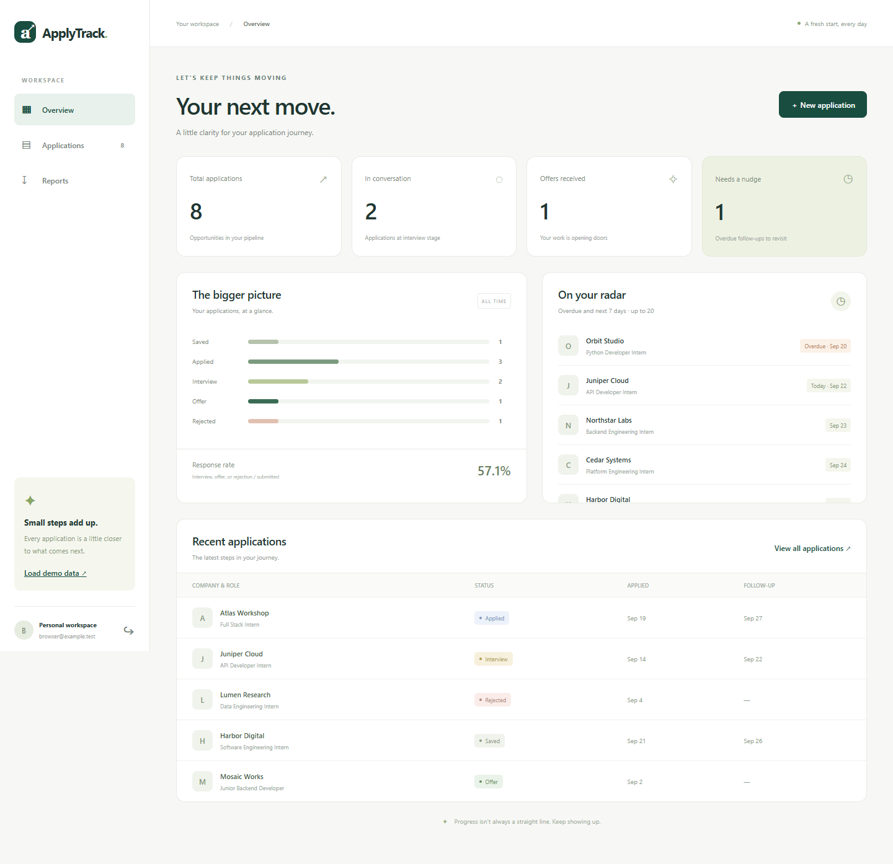

# ApplyTrack — Application Workspace

**Designed and developed by [Peter Maged](https://petermaged.com/).**

Organize job applications, follow-ups, progress analytics and downloadable PDF reports.

## Product and technical overview

- **Implementation:** Python, FastAPI, SQLite/WAL, Argon2 sessions, ReportLab.
- **Deployment:** Vercel frontend with an external backend; [DEPLOYMENT.md](DEPLOYMENT.md) contains exact settings and operational requirements.
- **Ownership:** Peter Maged's project implementation; third-party libraries and upstream materials retain their attribution.
- **License:** [LICENSE](LICENSE). Available for portfolio review, evaluation and further development under these terms.

For project enquiries and implementation work: [petermaged.com](https://petermaged.com/).

## Engineering guide and existing evidence

# ApplyTrack

**Your next chapter starts with a clear plan.**

A private application tracker for students and early-career job seekers. Keep applications and follow-up dates together, see your progress, and export a PDF without assembling a report by hand.

Built for the FlyRank **Your 10x Solution** backend capstone. Six original concepts, **zero swaps**, five core features, and no paid services or credit card.

**Public repository:** https://github.com/Mr-PeterMaged/applytrack-10x-capstone

**Quick start:** [Start Here](START_HERE.md)



## Start here

With **Python 3.12–3.14** installed, open a terminal in this folder:

```sh
python -m pip install -r requirements.txt
python run.py
```

On Windows, use `py` instead of `python` if needed. Open **http://localhost:8000**. Choose **Create an account**, use your own email or an invented `@example.test` address, and choose a password of at least ten characters. Click **Load demo data**. No preset passwords, API keys, or external accounts are needed.

Optional isolated environment first: `python -m venv .venv`, then activate it with `.venv\Scripts\Activate.ps1` on Windows or `source .venv/bin/activate` on macOS/Linux. If PowerShell activation is restricted, use `.venv\Scripts\python.exe` directly in the commands above.

**Docker alternative** (Docker Engine/Desktop with Compose installed):

```sh
docker compose up --build
```

Open the same URL. `docker compose up -d --build` runs in the background. `docker compose down` stops it and preserves the named data volume. Do not run the Python and Docker options on port 8000 simultaneously.

The first dependency installation/image build needs internet access. The application works offline afterward. Swagger UI at `/docs` uses a CDN; `/openapi.json` remains available offline.

## Five-minute demo

1. **0:00–1:00:** Open `/`, create an account, and click **Load demo data** (mobile: **Demo**). Eight explicitly fictional applications appear. Seeding again preserves existing data.
2. **1:00–2:00:** On Overview, see eight total applications, two interviews, one offer, and one overdue follow-up. “On your radar” includes overdue and upcoming seven-day follow-ups, at most 20.
3. **2:00–3:00:** Add an application, set its status and follow-up date, then open Applications. Search by company, filter by status, edit the record, and see the summary change.
4. **3:00–4:00:** Open Reports → **Create PDF report**. The API returns `202` immediately after saving the snapshot; the worker renders the PDF separately. Wait for Completed, click **Download PDF**, and open it.
5. **4:00–5:00:** Sign out and sign in again. Restart the server and confirm the records remain. Register a second account to see an empty, separate workspace.

No live presentation is required. Screenshots and the code are included for review.

## Problem and scope

Applicants often split progress across spreadsheets, notes, and tabs. Follow-ups are easy to miss, and a weekly update means collecting and counting the same records again. ApplyTrack puts that workflow in one place.

**10x hypothesis:** bring weekly report preparation from a hypothetical ten minutes of manual work to under one minute. This is a target, **not a measured productivity claim**. The demo and automated tests prove the workflow works; a real before/after timing study is still needed to validate the multiplier.

The five core features are private accounts, application management, a progress/follow-up dashboard, asynchronous PDF reports, and repeatable fictional demo data. **Non-goal:** submitting applications automatically or integrating job boards.

## Concepts implemented

| Original concept | Implementation | Where to inspect |
|---|---|---|
| API endpoints | Validated JSON, pagination, status/search filters, `201/202/204/401/404/409/422/429` responses | `app/main.py`, `app/models.py` |
| Database | SQLite tables, foreign keys, transactions, indexes, WAL, persistent Docker volume | `app/db.py`, `compose.yaml` |
| Authentication | Argon2id password hashes, random session tokens hashed at rest, expiry and logout revocation, ownership checks | `app/auth.py`, protected routes in `app/main.py` |
| Background jobs | Persistent queue, one worker thread, atomic claims, startup recovery of interrupted jobs, visible failure state | `app/reports.py` |
| PDF reporting | Paginated PDF containing aggregate counts, application details, dates and notes; request-time snapshot | `app/reports.py` |
| Caching logic | Per-user aggregate cache, 60-second TTL, same-transaction write invalidation, calendar-day guard; `X-Cache: HIT/MISS` | `app/analytics.py` |

**Swaps: 0.** No swap justification is needed. Tests, rate limiting, and Docker are extra engineering work, not substitutions. No LLM was included because the core problem is deterministic and does not need one.

## How it works

The browser uses same-origin JSON endpoints. Each request opens a short-lived SQLite connection and protected routes derive the owner from the session, never a submitted `user_id`. A report request saves an immutable application snapshot and queues a job. The single worker claims it, creates a PDF outside the request path, and stores the file in SQLite. A restart requeues interrupted work. Completed PDFs survive restarts and remain visible only to their owner.

The summary aggregates statuses and follow-ups. It is cached per user to avoid repeat aggregate queries. Reading and filling the cache is serialized with mutations, so a racing write cannot leave stale cached data behind. The browser updates immediately after mutations.

### Main API

| Method and route | Behavior |
|---|---|
| `POST /api/auth/register` | Create account and HttpOnly session cookie (`201`) |
| `POST /api/auth/login` | Sign in (`200`) |
| `GET /api/auth/me` | Current user, or `401` |
| `POST /api/auth/logout` | Revoke current session (`204`) |
| `GET /api/applications` | `q`, `status`, `limit` (1–100), `offset` |
| `POST /api/applications` | Create application (`201`) |
| `PUT /api/applications/{id}` | Replace application fields (`200`) |
| `DELETE /api/applications/{id}` | Delete own application (`204`) |
| `GET /api/summary` | Counts, response rate, follow-ups; `X-Cache` header |
| `POST /api/demo/seed` | Seed only an empty user workspace |
| `POST /api/reports` | Snapshot + job (`202` and Location header) |
| `GET /api/reports` | Latest 20 jobs for current user |
| `GET /api/reports/{id}` | Job state and safe error message |
| `GET /api/reports/{id}/download` | Own completed PDF; `409` until ready |
| `GET /api/health` | Database readiness |

Interactive documentation: **http://localhost:8000/docs**. Register or sign in through the UI first; the same browser session also authenticates Swagger requests.

Application example (without credentials):

```json
{
  "company": "Example Studio",
  "role": "Backend Intern",
  "status": "applied",
  "applied_on": "2026-09-22",
  "follow_up_on": "2026-09-29",
  "notes": "Fictional application for a demo."
}
```

### Configuration and seed script

| Environment variable | Default / meaning |
|---|---|
| `APPLYTRACK_DB` | `data/applytrack.db`; relative to current working directory |
| `HOST` | `127.0.0.1`; Docker uses `0.0.0.0` internally |
| `PORT` | `8000` |
| `COOKIE_SECURE` | `0` for local HTTP; set `1` when serving over HTTPS |
| `APPLYTRACK_WORKER` | `1`; `0` only for deterministic test control |
| `DEMO_EMAIL`, `DEMO_PASSWORD` | Optional CLI seed credentials; no defaults |

`.env.example` documents names; the app **does not automatically load .env files**. Set environment variables in your shell. After supplying your own `DEMO_EMAIL` and `DEMO_PASSWORD`, run `python -m app.seed`. It never changes an existing account password, refuses mismatched credentials, and preserves existing application records. The browser seed button avoids shell configuration entirely.

## Verification

Run the deterministic backend suite:

```sh
python -m pytest -q
```

Tests cover unauthorized access, cross-user isolation, expiry/revocation, validation, auth quotas, cache expiry/invalidation, idempotent seeding, readable PDF content, report snapshots/failures/recovery, queue limits, and persistence across application restarts. GitHub Actions runs the same suite on Python 3.12, 3.13 and 3.14.

Optional browser acceptance check:

```sh
python -m pip install playwright==1.63.0
python -m playwright install chromium
python scripts/browser_smoke.py
```

On Windows the script uses installed Microsoft Edge by default; set `BROWSER_CHANNEL=chromium` to use the downloaded Chromium instead. It creates an isolated temporary database/server, tests registration, demo, CRUD, search, PDF download, mobile layout and sign-out/sign-in, and saves screenshots/sample PDF under ignored `artifacts/`.

See [verification record](docs/VERIFICATION.md) and [architecture and tradeoffs](docs/ARCHITECTURE.md).

## Boundaries and tradeoffs

- Local capstone, designed for **one server process and one worker**. Do not use multiple Uvicorn workers/replicas against this queue; restart recovery assumes a single worker.
- Sessions last eight hours and use HttpOnly, SameSite=Strict cookies; logout revokes the current token. Authentication endpoints share a persisted limit of 20 attempts per client IP per five minutes. No proxy headers are trusted.
- Up to three pending reports per user; at most 2,000 applications per report. Reports and applications stay stored until explicitly removed or the local database is reset. There is no scheduled retention cleanup yet.
- Follow-ups are date based, using the server's calendar day. Container default timezone is UTC. No reminder emails or push notifications.
- Response rate means `(interview + offer + rejected) / all non-saved records`. This is a current-status metric, not an event history.
- Browser/database accept Unicode. The embedded PDF font is Bitstream Vera; reports are intended for English/Latin text. Full Arabic shaping and comprehensive multilingual PDF fonts are future work.
- This is not a production identity service: no password reset, email verification, or public internet deployment is included.
- SQLite database files, environment files, browser artifacts, and virtual environments are ignored by Git. User passwords and session tokens are never logged or committed. Seed records are fictional.

## Submission

Submit the **public repository URL** and [My 10x Solution - Peter Maged.md](My%2010x%20Solution%20-%20Peter%20Maged.md) through the internship portal. Do not upload a ZIP or the whole codebase. The overview is the requested submission document; there is no presentation requirement.

## Future ideas

Multilingual PDF typography, application event history, and a measured usability study. These are outside the five-feature capstone scope.

## Implementation references

- [FastAPI security documentation](https://fastapi.tiangolo.com/tutorial/security/oauth2-jwt/) — framework guidance and Argon2 hashing with pwdlib. This project uses revocable cookie sessions rather than the tutorial's JWT design.
- [Python SQLite documentation](https://docs.python.org/3/library/sqlite3.html) — connection and transaction behavior.

AI assistance was used to implement and verify this project. The owner should review the architecture, run the demo, and understand the code before submitting it.
